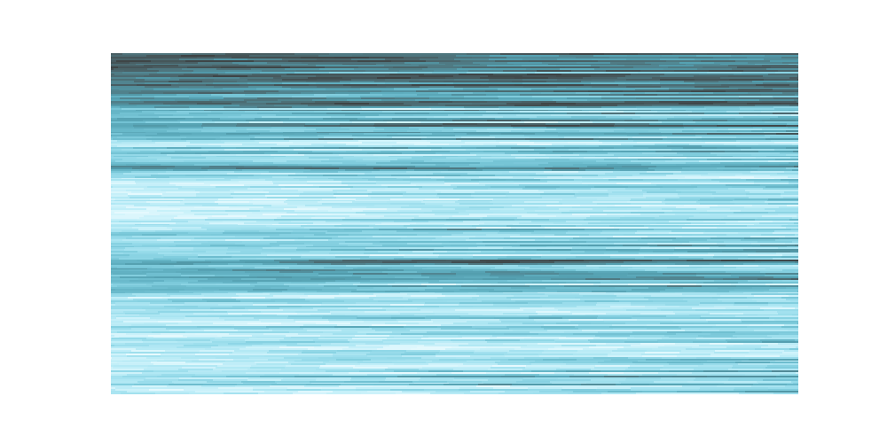
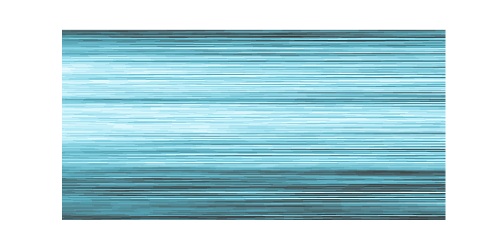

# generative
Generative art from stochastic processes

## "Ocean" v1
Created using a random walk over a probability distribution function

  <table>
    <tr>
      <td>
  
      </td>
      <td>
  
      </td>
    <tr>
    <tr>
      <td>
  
      </td>
      <td>
  
      </td>
    <tr>
 <table>

## Paintbrush streak texture
Created using a random walk over a probability distribution function
To be used later as part of a larger piece
  <table>
    <tr>
      <td>
  
      </td>
      <td>
  
      </td>
    <tr>
    <tr>
      <td>
  
      </td>
      <td>
  
      </td>
    <tr>
 <table>

## Tiling
Drawn from a probability distribution
To be used later for filling blocks of color in a less boring way

 <table>
    <tr>
      <td>
  
      </td>
      <td>
  
      </td>
    <tr>

 <table>
  
 ### Other
   
